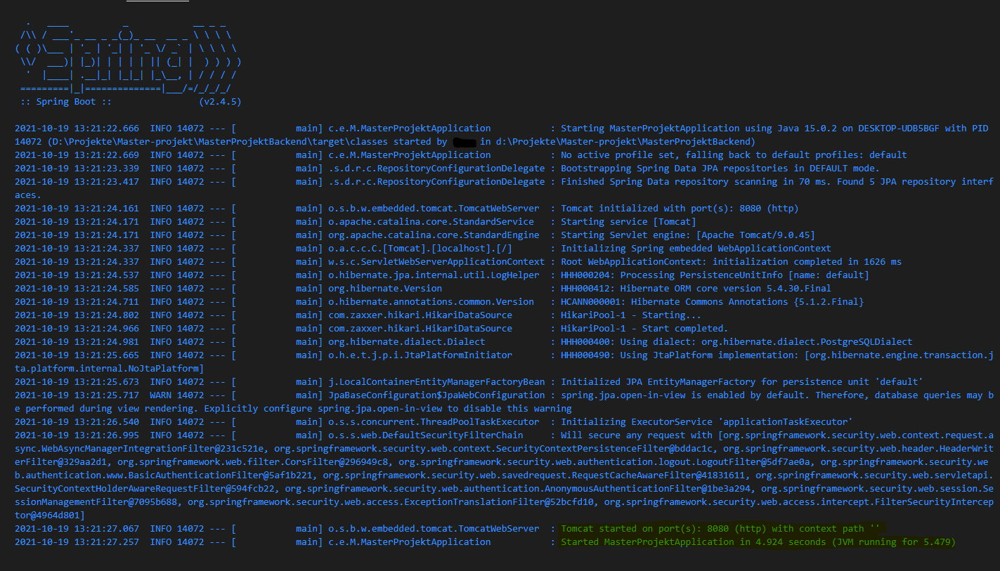

# MasterProjektBackend
Dieses Backend vereint Daten von BigQuery(HTTP Archive) und NVD.
Jeder Webseite des HTTP Archives können so passende Vulnerabilities des NVD zugeordnet werden. Die Anwendung ist mit Spring Boot 2 geschrieben.

# Setup
## Voraussetzung
- Zunächst wird ein Google API Key benötigt. Informationen zu [BigQuery](https://github.com/HTTPArchive/httparchive.org/blob/main/docs/gettingstarted_bigquery.md) und wie man einen [API-Key](https://cloud.google.com/docs/authentication/getting-started) erlangt findet ihr verlinkt.
    - Der Key sollte aus Sicherheitsgründen nicht weitergegeben oder bei Git eingecheckt werden.
- Docker
- Maven 
- Java 11+
- Wissen, wie man eine Spring Boot 2 Anwendung startet.
- pgAdmin4 um die DB einsehen zu können.

## Installation
Nach dem Klonen des Repositories muss zunächst einmal die `application.properties` im `resources` Ordner hinzugefügt werden. Da diese sensible Daten enthält, sollte auch diese Datei nicht bei Git eingecheckt werden.

Der Inhalt der `application.properties` ist dem folgenden Textblock zu entnehmen.


```
#google API Key Location
google.api.key.location=D://Projekte//Master-projekt//key.json

#login credentials
authentication.basic.username=ifis
authentication.basic.password=sifi

#Database
spring.datasource.url=jdbc:postgresql://localhost:5432/masterProject
spring.datasource.username=postgres
spring.datasource.password=test123
spring.jpa.properties.hibernate.dialect=org.hibernate.dialect.PostgreSQLDialect
# spring.jpa.hibernate.ddl-auto=create
# spring.jpa.hibernate.ddl-auto=create-drop
spring.jpa.hibernate.ddl-auto=none

# error
# server.error.whitelabel.enabled=false
server.error.include.message=always


#sql logging 
# logging.level.org.hibernate.SQL=DEBUG
# logging.level.org.hibernate.type.descriptor.sql.BasicBinder=TRACE
# spring.jpa.properties.hibernate.format_sql=true 
```

- google API Key Location
    - Der Pfad zum generierten Google-API-Key muss hier angegeben werden.
- login credentials
    - username und password können frei gewählt werden. Sie werden für die Basic Authentication benötigt.
- Database
    - Die Credentials sind mit dem `docker-compose.yml` abgestimmt
    - Beim ersten Start der Applikation sollte `ddl-auto=create` sein um die DB-Tabellen zu erstellen. Bei jedem weiteren Start sollte `ddl-auto=none` sein.
    - Bei der DB handelt es sich um eine PostgreSQL DB
- error
    - Verbessert die ausgegebenen Fehlermeldungen.
- sql logging
    - wird genutzt, um die ausgeführten JPQL Statements im jeweiligen DB-Dialekt in der Console sichbar zu machen. 

Als nächstes muss pgAdmin4 installiert werden.
## Startup

### Initial Startup

1. Sicherstellen, dass beim ersten Start `ddl-auto=create` ist.
2. pgAdmin4 ausführen
    - Das Masterpasswort kann beliebig gewählt werden. Der Nutzername und das Passwort muss dem in der `docker-compose.yml`und der `application.properties` entsprechen und auch so gewählt werden.
    - Zum Beispiel: `username=postgres
    password=test123`
3. Einen neue leere Datenbank muss erstellt werden.
    - Der Name muss wieder dem in der `docker-compose.yml`und der `application.properties` entsprechen.
    - Zum Beispiel: `masterProject`
4. Starten der DB aus dem root Ordner des Projektes mit dem Befehlt `docker-compose up -d`.
    - Unter Linux müsst ihr wahrscheinlich `sudo` verwenden.
5. Starten der Applikation
6. Die Konsole nach einem erfolgreichen Start sollte in etwa wie folgt aussehen: 
7. Ein erfolgreicher Start lässt sich unter dem Endpunkt `localhost:8080/test` prüfen.

#### Füllen der DB
1. Die Applikation muss laufen.
2. Der Endpunkt `localhost:8080/admin/parseNVDToDatabase` muss aufgerufen werden. Credentials sind die vorher in der `application.properties`definierten.
    - Das Parsen der CVE's beginnt. Der Progress wird in der Console angezeigt.

# Endpunkte und Requests
- `localhost:8080/technologies?startDate=jjjj_mm&endDate=jjjj_mm&countryCode=xxx`
    - Beispielquery: `localhost:8080/technologies?startDate=2016_01&endDate=2016_05&countryCode=com`
    - Returned die Anzahl an verwundbaren Webseiten für ein Land in einem Zeitraum.
- `localhost:8080/admin/technologies?startDate=jjjj_mm&endDate=jjjj_mm&countryCode=xxx`
    - Beispielquery: `localhost:8080/admin/technologies?startDate=2016_01&endDate=2016_05&countryCode=com`
    - Returned die verwundbaren Webseiten für ein Land in einem Zeitraum.
- `localhost:8080/CWE?startDate=jjjj_mm&endDate=jjjj_mm&cwe=CWE-nn`
    - Beispielquery: `localhost:8080/CWE?startDate=2016_01&endDate=2016_01&cwe=CWE-20`
    - Returned die Anzahl an verwundbaren Webseiten für einen Zeitraum und Vulnerability.
- `localhost:8080/admin/CWE?startDate=jjjj_mm&endDate=jjjj_mm&cwe=CWE-nn`
    - Beispielquery: `localhost:8080/admin/CWE?startDate=2016_01&endDate=2016_01&cwe=CWE-20`
    - Returned die verwundbaren Webseiten für einen Zeitraum und Vulnerability.
- `localhost:8080/impactScore?startDate=jjjj_mm&endDate=jjjj_mm&lowerLimit=nn.nn&upperLimit=nn.nn`
    - Beispielquery: `localhost:8080/impactScore?startDate=2016_01&endDate=2016_02&lowerLimit=1.4&upperLimit=3.0`
    - Returned die Anzahl an verwundbaren Webseiten für einen Zeitraum und den angegebenen Impact Score.
- `localhost:8080/admin/impactScore?startDate=jjjj_mm&endDate=jjjj_mm&lowerLimit=nn.nn&upperLimit=nn.nn`
    - Beispielquery: `localhost:8080/admin/impactScore?startDate=2016_01&endDate=2016_02&lowerLimit=1.4&upperLimit=3.0`
    - Returned die verwundbaren Webseiten für einen Zeitraum und den angegebenen Impact Score.
- `localhost:8080/exploitabilityScore?startDate=jjjj_mm&endDate=jjjj_mm&lowerLimit=nn.nn&upperLimit=nn.nn`
    - Beispielquery: `localhost:8080/exploitabilityScore?startDate=2016_01&endDate=2016_02&lowerLimit=1.4&upperLimit=3.0`
    - Returned die Anzahl an verwundbaren Webseiten für einen Zeitraum und den angegebenen exploitabilityScore Score.
- `localhost:8080/admin/exploitabilityScore?startDate=jjjj_mm&endDate=jjjj_mm&lowerLimit=nn.nn&upperLimit=nn.nn`
    - Beispielquery: `localhost:8080/admin/exploitabilityScore?startDate=2016_01&endDate=2016_02&lowerLimit=1.4&upperLimit=4.0`
    - Returned die verwundbaren Webseiten für einen Zeitraum und den angegebenen exploitabilityScore Score.

Viel Spaß

